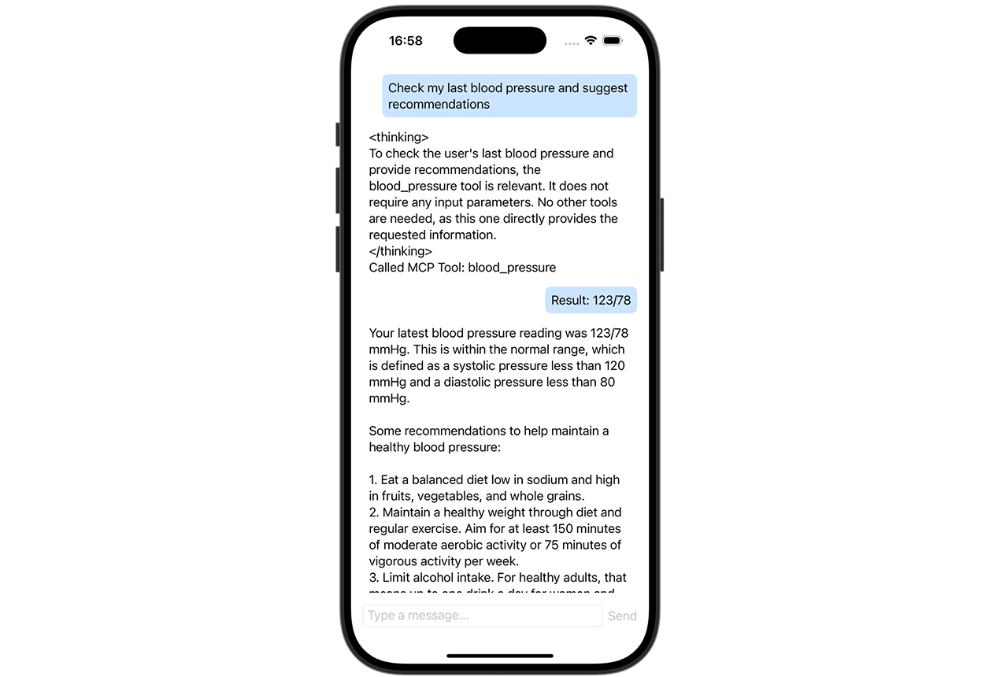

# Creating MCP Servers in Swift

An example project for [Using Model Context Protocol in iOS apps](https://www.artemnovichkov.com/blog/using-model-context-protocol-in-ios-apps) article.

  

## Author

Artem Novichkov, https://www.artemnovichkov.com/

## License

The project is available under the MIT license. See the [LICENSE](./LICENSE) file for more info.